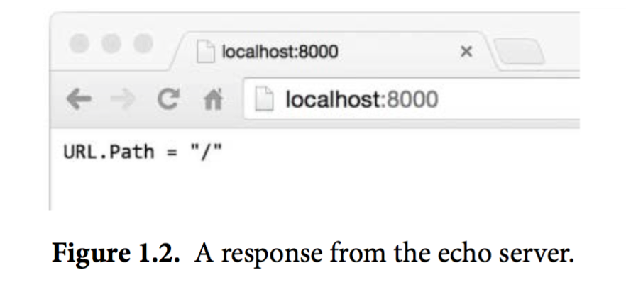
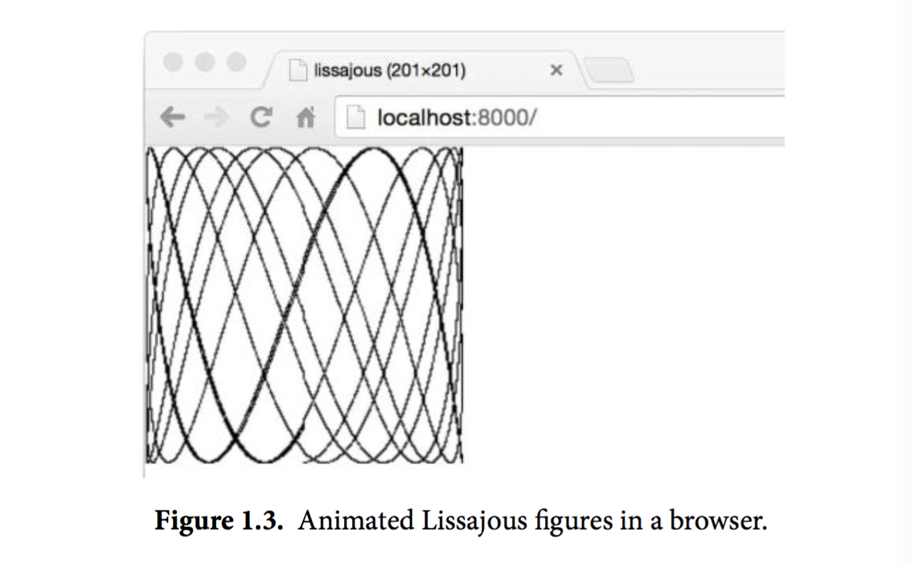

## 1.7. Web服务

Go的内置库让我们写一个像fetch这样例子的web服务器变得异常地简单。在本节中，我们会展示一个微型服务器，这个服务的功能是返回当前用户正在访问的URL。也就是说比如用户访问的是http://localhost:8000/hello，那么响应是URL.Path = "hello"。
```go
gopl.io/ch1/server1
// Server1 is a minimal "echo" server.
package main

import (
    "fmt"
    "log"
    "net/http"
)

func main() {
    http.HandleFunc("/", handler) // each request calls handler
    log.Fatal(http.ListenAndServe("localhost:8000", nil))
}

// handler echoes the Path component of the request URL r.
func handler(w http.ResponseWriter, r *http.Request) {
     fmt.Fprintf(w, "URL.Path = %q\n", r.URL.Path)
}
```

我们只用了八九行就实现了这个程序，这都是多亏了标准库里的方法已经帮我们处理了大多数的工作。main函数会将所有发送到/目录下的请求和handler函数关联起来，/开头的请求其实就是所有发送到当前站点上的请求，我们的服务跑在了8000端口上。发送到这个服务的“请求”是一个http.Request类型的对象，这个对象中包含了请求中的一系列相关字段，其中就包括我们需要的URL。当请求到达服务器时，这个请求会被传给handler函数来处理，这个函数会将/hello这个路径从请求的URL中解析出来，然后把其发送到响应中，这里我们用的是标准输出流的fmt.Fprintf。Web服务会在第7.7节中详细阐述。

让我们在后台运行这个服务程序。如果你的操作系统是Mac OS X或者Linux，那么在运行命令的末尾加上一个&符号，即可让程序简单地跑在后台，而在windows下，你需要在另外一个命令行窗口去运行这个程序了。

```
$ go run src/gopl.io/ch1/server1/main.go &
```

现在我们可以通过命令行来发送客户端请求了：

```
$ go build gopl.io/ch1/fetch
$ ./fetch http://localhost:8000
URL.Path = "/"
$ ./fetch http://localhost:8000/help
URL.Path = "/help"
```

另外我们还可以直接在浏览器里访问这个URL，然后得到返回结果，如图1.2：


在这个服务的基础上叠加特性是很容易的。一种比较实用的修改是为访问的url添加某种状态。比如，下面这个版本输出了同样的内容，但是会对请求的次数进行计算；对URL的请求结果会包含各种URL被访问的总次数，直接对/count这个URL的访问要除外。

```go
gopl.io/ch1/server2
// Server2 is a minimal "echo" and counter server.
package main

import (
    "fmt"
    "log"
    "net/http"
    "sync"
)

var mu sync.Mutex
var count int

func main() {
    http.HandleFunc("/", handler)
    http.HandleFunc("/count", counter)
    log.Fatal(http.ListenAndServe("localhost:8000", nil))
}

// handler echoes the Path component of the requested URL.
func handler(w http.ResponseWriter, r *http.Request) {
    mu.Lock()
    count++
    mu.Unlock()
    fmt.Fprintf(w, "URL.Path = %q\n", r.URL.Path)
}

// counter echoes the number of calls so far.
func counter(w http.ResponseWriter, r *http.Request) {
    mu.Lock()
    fmt.Fprintf(w, "Count %d\n", count)
    mu.Unlock()
}
```

这个服务器有两个请求处理函数，请求的url会决定具体调用哪一个：对/count这个url的请求会调用到count这个函数，其它所有的url都会调用默认的处理函数。如果你的请求pattern是以/结尾，那么所有以该url为前缀的url都会被这条规则匹配。在这些代码的背后，服务器每一次接收请求处理时都会另起一个goroutine，这样服务器就可以同一时间处理多数请求。然而在并发情况下，假如真的有两个请求同一时刻去更新count，那么这个值可能并不会被正确地增加；这个程序可能会被引发一个严重的bug：竞态条件(参见9.1)。为了避免这个问题，我们必须保证每次修改变量的最多只能有一个goroutine，这也就是代码里的mu.Lock()和mu.Unlock()调用将修改count的所有行为包在中间的目的。第九章中我们会进一步讲解共享变量。

下面是一个更为丰富的例子，handler函数会把请求的http头和请求的form数据都打印出来，这样可以让检查和调试这个服务更为方便

```go
gopl.io/ch1/server3
// handler echoes the HTTP request.
func handler(w http.ResponseWriter, r *http.Request) {
    fmt.Fprintf(w, "%s %s %s\n", r.Method, r.URL, r.Proto)
    for k, v := range r.Header {
        fmt.Fprintf(w, "Header[%q] = %q\n", k, v)
    }
    fmt.Fprintf(w, "Host = %q\n", r.Host)
    fmt.Fprintf(w, "RemoteAddr = %q\n", r.RemoteAddr)
    if err := r.ParseForm(); err != nil {
        log.Print(err)
    }
    for k, v := range r.Form {
         fmt.Fprintf(w, "Form[%q] = %q\n", k, v)
    }
}
```

我们用http.Request这个struct里的字段来输出下面这样的内容：

```
GET /?q=query HTTP/1.1
Header["Accept-Encoding"] = ["gzip, deflate, sdch"] Header["Accept-Language"] = ["en-US,en;q=0.8"]
Header["Connection"] = ["keep-alive"]
Header["Accept"] = ["text/html,application/xhtml+xml,application/xml;..."] Header["User-Agent"] = ["Mozilla/5.0 (Macintosh; Intel Mac OS X 10_7_5)..."] Host = "localhost:8000"
RemoteAddr = "127.0.0.1:59911"
Form["q"] = ["query"]
```

Notice how the call to ParseForm is nested within an if statement. Go allows a simple state- ment such as a local variable declaration to precede the if condition, which is particularly useful for error handling as in this example. We could have written it as

```go
err := r.ParseForm()
if err != nil {
    log.Print(err)
}
```


but combining the statements is shorter and reduces the scope of the variable err, which is good practice. We’ll define scope in Section 2.7.
In these programs, we’ve seen three very different types used as output streams. The fetch program copied HTTP response data to os.Stdout, a file, as did the lissajous program. The fetchall program threw the response away (while counting its length) by copying it to the trivial sink ioutil.Discard. And the web server above used fmt.Fprintf to write to an http.ResponseWriter representing the web browser.
Although these three types differ in the details of what they do, they all satisfy a common interface, allowing any of them to be used wherever an output stream is needed. That inter- face, called io.Writer, is discussed in Section 7.1.
Go’s interface mechanism is the topic of Chapter 7, but to give an idea of what it’s capable of, let’s see how easy it is to combine the web server with the lissajous function so that ani- mated GIFs are written not to the standard output, but to the HTTP client. Just add these lines to the web server:
```
handler := func(w http.ResponseWriter, r *http.Request) {
     lissajous(w)
}
http.HandleFunc("/", handler)
```

或者另一种等价形式：
```
http.HandleFunc("/", func(w http.ResponseWriter, r *http.Request) {
    lissajous(w)
})
```

HandleFunc函数的第二个参数是一个函数的字面值，也就是一个在使用时定义的匿名函数。这些内容我们会在5.6节中讲解。


做完这些修改之后，在浏览器里访问http://localhost:8000。每次你载入这个页面都可以看到一个像图1.3那样的动画。

```
Exercise 1.12:修改Lissajour服务，从URL读取变量，比如你可以访问http://localhost:8000/?cycles=20这个URL，这样访问可以将程序里的cycles默认的5修改为20。字符串转换为数字可以调用strconv.Atoi函数。你可以在dodoc里查看strconv.Atoi的详细说明。
```


